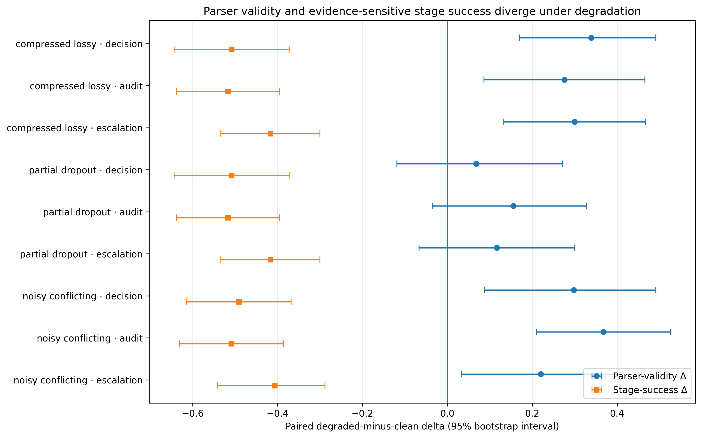
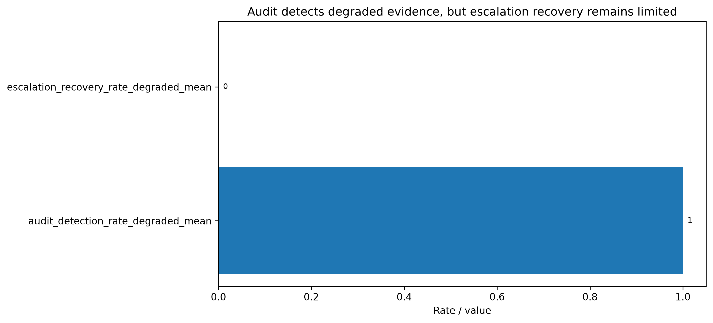
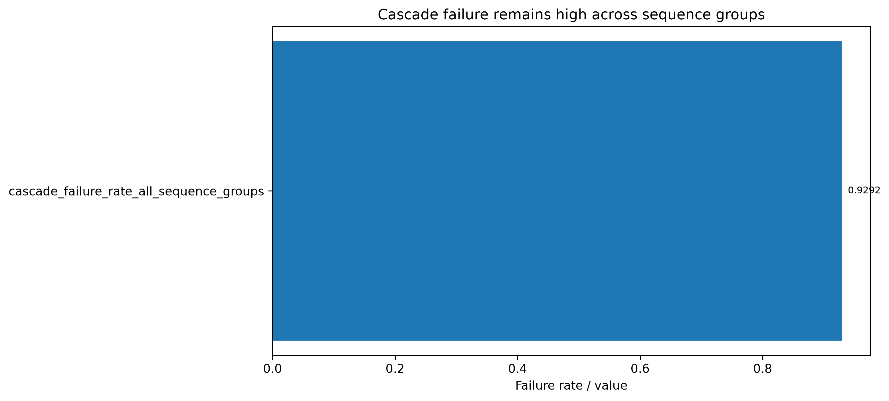
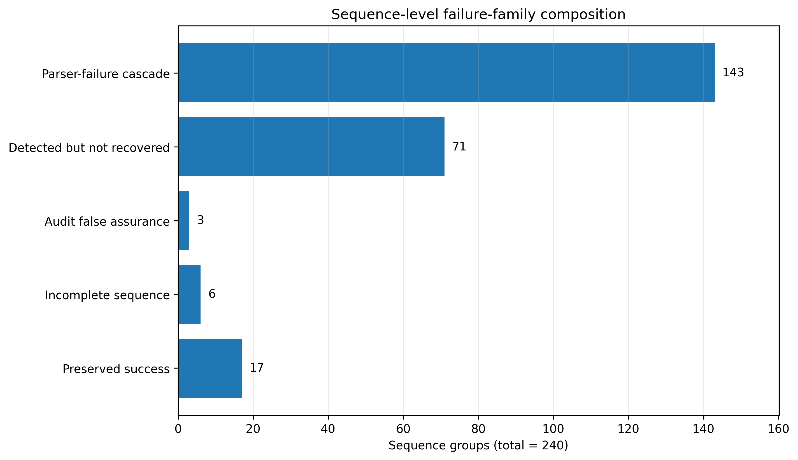

# Evidence-State Reliability Under Controlled Degradation: Parser-Validity Divergence in a Multi-Stage LLM Pipeline

## Abstract

Multi-stage large language model (LLM) pipelines can satisfy structural output contracts even when the evidence available to downstream stages has become incomplete, compressed, or conflicting. This study formalises Evidence-State Reliability (ESR) as the reliability of intermediate evidence states for evidence-sensitive stage objectives and separates it from parser validity. One controlled, scaled run evaluated GLM-5.2 on 60 sanitized, CFPB-backed base cases, each represented under clean, compressed-lossy, partial-dropout, and noisy-conflicting evidence conditions and processed through decision, audit, and escalation stages. The design comprised 720 planned and ledgered calls; 713 sanitized execution rows were retained. Across the nine degraded condition-stage comparisons, every stage-success point estimate was negative and every 95% bootstrap interval remained below zero. All nine parser-validity point estimates were positive, although the three partial-dropout intervals included zero. Degraded audit detection was 1.0 in each condition, while false-assurance rates remained non-zero and escalation recovery was 0.0. The sequence-level cascade-failure proxy identified 223 failures among 240 condition-level sequence groups. The findings demonstrate a within-run reliability-layer divergence: structural conformance can improve directionally while evidence-sensitive success deteriorates. ESR therefore provides a distinct evaluation layer for this pipeline, while the conclusion remains limited to one model configuration, one pipeline design, one scaled run, sanitized evidence, and model-output-coded scoring.

**Keywords:** Evidence-State Reliability; reliability cascades; multi-stage LLM pipelines; parser validity; evidence sufficiency; computational audit; escalation; controlled degradation

## 1. Introduction

Large language models increasingly appear inside pipelines rather than as isolated question-answering systems. A pipeline may retrieve or receive evidence, transform it into an intermediate state, produce a decision, inspect that decision through an audit component, and route difficult cases into an escalation mechanism. Reliability in such a system depends not only on the final answer but also on the quality of the state passed between stages. Information may be removed during compression, omitted through dropout, or made difficult to reconcile by conflict. Once that change occurs, later stages can operate on an evidence state that is already inadequate even when every output remains syntactically well formed.

Many evaluation practices emphasise final-answer correctness, aggregate task accuracy, calibration, faithfulness, or schema compliance. These dimensions are necessary but answer different questions. Parser validity establishes that an output satisfies a machine-readable contract. It does not establish that the evidence was sufficient, that the stage objective was achieved, or that a detected problem was corrected. This distinction becomes particularly important in automated decision pipelines, where structurally valid objects can be consumed by subsequent components without triggering an obvious technical failure. The pipeline can therefore look operational while its substantive evidential basis has deteriorated.

Reliability loss can therefore follow a pathway that is invisible to endpoint testing. An upstream transformation changes what is knowable; the decision stage produces an output from that altered state; the audit stage may or may not recognise the change; and escalation may receive no additional evidence with which to repair it. Measuring only the final object collapses these distinct events. ESR makes the handoff itself an evaluation target and asks whether later stages are being supplied with evidence capable of supporting their assigned functions.

This paper studies that problem through Evidence-State Reliability (ESR). ESR concerns whether the evidence supplied to a downstream stage remains sufficiently complete, grounded, and usable for the evidence-sensitive function assigned to that stage. It is a construct about the intermediate evidence state, not a synonym for parser validity or final-answer correctness. In the present experiment, ESR is operationalised through stage-specific success under a committed, sanitized scoring contract. That operational indicator is deliberately narrower than the full construct: it provides a measurable test within one pipeline without claiming to exhaust every dimension of evidential reliability.

The central research question is:

> **How can Evidence-State Reliability be measured separately from parser validity in a multi-stage LLM decision pipeline?**

The experiment addresses this question through controlled within-case evidence interventions. Sixty sanitized base cases derived from the context of the Consumer Financial Protection Bureau (CFPB) Consumer Complaint Database were each represented under four conditions: a clean baseline, lossy compression, partial evidence dropout, and noisy or conflicting evidence. Each condition was evaluated at decision, audit, and escalation stages, giving 720 planned calls. The analysis keeps parser validity separate from evidence-sensitive stage success, examines paired degraded-minus-clean changes, quantifies audit detection and false assurance, evaluates escalation recovery, and summarises three-stage sequence patterns.

The design supports three analytical expectations rather than universal hypotheses about LLMs. First, if parser validity and evidence-sensitive reliability measure different layers, their responses to evidence degradation need not move together. Second, an audit stage can detect degraded evidence without producing recovery, so detection and remediation should be measured separately. Third, failures can accumulate across a sequence even when individual outputs are structurally valid, making a cascade-level view informative beyond final-output checks.

The study makes four bounded contributions. First, it formalises parser-validity rate, an operational ESR rate, reliability-layer divergence, and false assurance at the format layer as separate quantities. Second, it implements controlled evidence-state interventions across a decision-audit-escalation sequence. Third, it reports condition-by-stage results and paired uncertainty estimates rather than relying only on aggregate headline values. Fourth, it connects stage-level behaviour to sequence-level cascade patterns, distinguishing parser failure, detected-but-unrecovered degradation, false assurance, incomplete sequences, and preserved success.

The strongest supported conclusion is confined to the evaluated setting: within the scaled GLM-5.2 experiment, controlled evidence degradation reduced evidence-sensitive stage success while parser-validity point estimates increased across decision, audit, and escalation comparisons. The stage-success evidence is interval-stable in this sample; the parser-validity direction is less uniform in uncertainty terms because three partial-dropout intervals include zero. The paper does not claim cross-model generality, provider independence, deployment safety, regulatory validity, real-world financial decision validity, complaint truth, misconduct, prevalence, or universal LLM unreliability.

The remainder of the paper positions ESR relative to multidimensional evaluation, structured outputs, evidence sufficiency, auditing, deferral, and cascade research; describes the controlled design and operational measures; reports accounting, condition-stage, uncertainty, audit, escalation, and cascade results; and discusses implications, alternative explanations, validity threats, and future replication.

## 2. Related Work

### 2.1 Multidimensional evaluation beyond aggregate correctness

A central lesson from modern model evaluation is that a single aggregate score can hide functionally important weaknesses. Behavioural testing frameworks such as CheckList decompose model performance into capability-oriented tests rather than assuming that held-out accuracy represents all relevant behaviour (Ribeiro et al., 2020). Calibration research similarly separates predictive correctness from the quality of confidence estimates (Guo et al., 2017). These traditions establish that apparently successful outputs can remain deficient along another evaluation dimension.

Retrieval-augmented generation extends this decomposition by evaluating the relationship among retrieved context, faithful context use, and answer relevance. RAGAS and ARES, for example, distinguish context- and answer-level properties that would be blurred by a single final-response score (Es et al., 2024; Saad-Falcon et al., 2024). ESR shares the multidimensional principle but places the object of evaluation at a different point in the system: the intermediate evidence state presented to a stage and the stage's evidence-sensitive success under that state. It therefore complements rather than replaces answer accuracy, calibration, or faithfulness.

### 2.2 Structured output validity and substantive adequacy

Structured output is an important engineering requirement. Grammar-constrained decoding and related methods improve adherence to formal output specifications, enabling automated validation and downstream execution (Geng et al., 2023). Recent benchmark and preprint work also distinguishes structural validity from value-level correctness, executable correctness, or task performance (Ray, 2026, preprint; Singh et al., 2026, preprint). This literature makes clear that a valid schema is not identical to a correct answer.

The present work does not claim to originate that distinction. Its narrower contribution is to connect structural conformance to controlled evidence-state interventions inside a multi-stage sequence. Parser validity is measured at every stage, while evidence-sensitive success is evaluated separately. The resulting comparison asks whether output form and evidential reliability respond differently when the evidence itself is manipulated. This is particularly relevant when parser-valid outputs continue through an automated chain and may therefore create an appearance of normal operation.

### 2.3 Evidence sufficiency and intermediate support

Evidence sufficiency has been studied directly in fact checking and increasingly in retrieval and selective-generation settings. Work on fact checking with insufficient evidence demonstrates that systems must distinguish unsupported cases from cases where available evidence can justify a conclusion (Atanasova et al., 2022, preprint). Recent preprints on sufficiency-aware retrieval and delayed ground truth further emphasise that evidence availability and timing can determine whether a task is answerable or safely actionable (Qiu et al., 2026, preprint; Solozobov, 2026, preprint).

ESR draws from this concern but focuses on transitions within a pipeline. The evidence state is not treated solely as a static context attached to a final answer. Instead, controlled versions of the same base case are propagated through decision, audit, and escalation functions. This design makes it possible to ask whether degradation is reflected in stage success, whether it is detected, whether detection is accompanied by false assurance, and whether a later mechanism recovers. The unit of analysis is thus both the stage and the condition-linked sequence.

### 2.4 Component-aware systems, auditing, and escalation

Agent and pipeline evaluation increasingly recognises that component-level behaviour matters. AgentBench evaluates distinct capabilities required by interactive agents, while RAG evaluation frameworks assess components that contribute to a final response (Liu et al., 2024; Es et al., 2024; Saad-Falcon et al., 2024). A final-output-only perspective can miss the stage at which a failure originated or the mechanism through which it propagated.

Algorithmic-audit research addresses a broader institutional process that includes documentation, accountability, governance, and organisational practice (Raji et al., 2020). The audit stage in this paper is intentionally narrower: it is a computational, model-output-coded stage that indicates whether degradation was detected and whether a false-assurance flag appeared under the experimental contract. It is not an independent institutional audit and does not establish regulatory assurance.

Selective prediction and learning-to-defer research provide related distinctions between prediction, abstention, and expert referral (Geifman and El-Yaniv, 2019; Mozannar and Sontag, 2020). These approaches show that declining to decide or deferring a case is a separate function requiring its own objective. The present escalation stage is not a learned optimal deferral policy. It tests whether the implemented downstream mechanism recovered after evidence degradation. Separating audit detection from escalation recovery follows the same functional logic: recognising a problem and restoring reliable operation are not equivalent outcomes.

### 2.5 Cascades and propagation

Cascading failure is a long-established systems concept in which local losses can propagate through connected structures (Motter and Lai, 2002). Emerging LLM research studies error or hallucination propagation in collaborative multi-agent systems (Xie et al., 2026, preprint; Jamshidi et al., 2026, preprint). Those settings differ from the present controlled decision pipeline, but they reinforce the importance of sequence-aware evaluation.

Here, a reliability cascade is defined operationally and narrowly. It is a condition-linked three-stage pattern in which parser failure, evidence-sensitive failure, detected-but-unrecovered degradation, false assurance, or sequence incompleteness prevents a preserved successful path. The cascade measure is not presented as a general theory of complex-system failure or as an estimate of deployment prevalence. Its purpose is to summarise how stage-level outcomes combine within the evaluated sequence.

### 2.6 Financial provenance and bounded combination gap

Financial-sector reports motivate careful testing, interpretability, auditability, and governance when AI is used in financial services (Financial Stability Board, 2017; Financial Stability Board, 2026, consultation report). The CFPB Consumer Complaint Database provides a public source context but carries explicit interpretive limitations: complaints are consumer accounts, are not a statistical sample, and require contextual interpretation (Consumer Financial Protection Bureau, 2025). In this study, the database supplies provenance for sanitized evidence packets only. It does not supply adjudicated ground truth about misconduct, prevalence, consumer harm, or regulatory validity.

The adjacent literatures therefore cover many ingredients independently: multidimensional evaluation, structured-versus-substantive validity, evidence sufficiency, component-aware assessment, computational and institutional auditing, deferral, and cascading failure. The unresolved combination addressed here is the joint operationalisation of controlled evidence-state degradation, stage-specific success, parser validity, audit detection, false assurance, escalation recovery, paired uncertainty, and sequence-level cascade patterns in one reproducible multi-stage experiment. The novelty claim is consequently bounded: combination-and-operationalisation differentiation is supported, while global priority is not established.

## 3. Methodology

### 3.1 Study design

The study used a paired, controlled design centred on 60 sanitized base cases. Each base case appeared once under four evidence conditions and was evaluated at three pipeline stages. The resulting design contained \(60 \times 4 \times 3 = 720\) planned and ledgered calls. Pairing preserved the base-case identity across conditions, allowing each degraded condition to be compared with the clean condition within the same case and stage.

The 60 cases were selected from a committed sanitized evidence-state package in which every selected packet had all four recognised conditions. The execution manifest records 240 evidence-state rows: 60 clean, 60 compressed-lossy, 60 partial-dropout, and 60 noisy-conflicting. The selected set is not a probability sample. Case identifiers and evidence materials are sanitized, and the committed reporting boundary excludes raw CFPB records, raw prompts, raw responses, JSONL output archives, API credentials, and environment files.

CFPB provenance is used to create a realistic complaint-context substrate, not to establish the truth of any complaint or the quality of a real financial decision. The experimental units are sanitized evidence states and model-output-coded stage outcomes. Consequently, the study evaluates a controlled reliability mechanism rather than consumer outcomes, company behaviour, regulatory compliance, or population prevalence.

### 3.2 Evidence conditions

The **clean** condition is the non-degraded baseline evidence state against which the other conditions are paired. “Clean” is an experimental label, not a claim that the baseline is technically perfect, complete in every real-world sense, or guaranteed to produce parser-valid outputs.

The **compressed-lossy** condition tests whether information compression and loss alter downstream behaviour. It represents a state in which evidence has been condensed in a way that can remove details needed by later stages. The intervention is relevant to pipelines that summarise or transform evidence before decision-making.

The **partial-dropout** condition tests sensitivity to missing evidence elements. It creates a controlled absence rather than a contradictory signal. This distinction matters because missing information may produce uncertainty without providing an explicit cue that the remaining evidence is wrong.

The **noisy-conflicting** condition tests behaviour when evidence contains conflict or distracting inconsistency. Unlike partial dropout, it introduces competing signals that may be detectable by an audit stage but still difficult for a downstream recovery mechanism to resolve.

The three degraded conditions are not intended to exhaust evidence failure in deployed systems. They do not directly model temporal staleness, distribution shift, adversarial manipulation, ambiguous policy, or delayed verification. They provide three reproducible intervention families—loss through compression, loss through omission, and conflict through noise—within which parser and evidence-sensitive outcomes can be compared.

### 3.3 Pipeline stages

The pipeline contains decision, audit, and escalation stages, each evaluated under a stage-specific contract.

The **decision stage** produces an assessment or recommendation from the supplied evidence state. Its primary measurements are parser validity, evidence adequacy as encoded in the sanitized output fields, and the stage-success indicator. The decision stage establishes whether a usable initial output is produced under each evidence condition.

The **audit stage** evaluates whether the evidence and decision state indicate degradation or concern. Among parser-valid audit rows, two additional indicators are reported: degradation detection and false assurance. Detection records the model-output-coded audit signal that degradation was recognised. False assurance records the corresponding experimental flag that format-level or audit-level success could coexist with evidence-sensitive failure. These are computational indicators inside the pipeline, not an external audit opinion.

The **escalation stage** evaluates what happens after degradation has entered the sequence. Among parser-valid escalation rows, recovery indicates whether the implemented mechanism restored stage success; the loss proxy indicates continued failure. The design therefore treats detection and recovery as separate functions. An audit can identify a problem while the escalation stage still fails to produce a successful evidence-sensitive outcome.

The stages form an analytical sequence, but this paper does not expose or claim replayability of raw prompts and responses. The committed sanitized rows provide the parser and stage-specific fields used for evaluation. The study therefore supports artifact-level reconstruction of the reported metrics rather than full prompt-level reproduction of model behaviour.

### 3.4 Constructs and operational measures

Let \(E_{i,c,k}\) denote the evidence state associated with base case \(i\), evidence condition \(c\), and stage \(k\). Let \(V_{i,c,k}\in\{0,1\}\) indicate parser validity. Parser validity means that the sanitized model output satisfied the required structural contract. It is necessary for automated consumption but is not a measure of evidence sufficiency, answer correctness, or real-world decision quality.

Let \(R_{i,c,k}\in\{0,1\}\) denote evidence-sensitive stage success under the committed scoring contract. Operationally, a row is stage-successful when it is parser-valid and contains a positive sanitized `validity_judgment`. Rows without parser-valid output or without a positive judgment are not counted as successful. This rule makes stage success auditable from committed artifacts, but it also creates a construct-validity dependency: unknown or absent judgments are treated as non-success rather than independently adjudicated outcomes.

For \(N_{c,k}\) retained rows in a condition-stage cell, the parser-validity rate and operational ESR rate are

\[
\widehat{\mathrm{PV}}_{c,k}
=
\frac{1}{N_{c,k}}\sum_{i=1}^{N_{c,k}} V_{i,c,k},
\qquad
\widehat{\mathrm{ESR}}_{c,k}
=
\frac{1}{N_{c,k}}\sum_{i=1}^{N_{c,k}} R_{i,c,k}.
\]

The notation \(\widehat{\mathrm{ESR}}\) refers to the experiment's operational indicator, not a claim that stage success fully measures every aspect of ESR. The construct is broader: it concerns the completeness, grounding, and usability of intermediate evidence for a stage objective. The indicator is one committed measurement of that construct in this pipeline.

For degraded condition \(c\) relative to clean condition \(c_0\), paired changes are

\[
\Delta\mathrm{PV}_{c,k}
=
\widehat{\mathrm{PV}}_{c,k}
-
\widehat{\mathrm{PV}}_{c_0,k},
\qquad
\Delta\mathrm{ESR}_{c,k}
=
\widehat{\mathrm{ESR}}_{c,k}
-
\widehat{\mathrm{ESR}}_{c_0,k}.
\]

The actual analysis computes these contrasts within base case and stage, using cases available in both members of the pair. **Reliability-layer divergence** is

\[
\mathrm{RLD}_{c,k}
=
\Delta\mathrm{PV}_{c,k}
-
\Delta\mathrm{ESR}_{c,k}.
\]

A positive divergence is especially informative when the parser-validity estimate is positive and the stage-success estimate is negative, because format conformance and evidence-sensitive success move in opposite directions.

**False assurance at the format layer** occurs when an output is parser-valid but evidence-unsuccessful:

\[
\widehat{\mathrm{FA}}_{c,k}
=
\frac{1}{N_{c,k}}
\sum_{i=1}^{N_{c,k}}
V_{i,c,k}(1-R_{i,c,k}).
\]

The audit-specific reported false-assurance rate uses parser-valid audit rows as its denominator and the committed `audit_false_assurance` field as its numerator. It is a controlled pipeline proxy, not a claim that every parser-valid output is substantively wrong.

Audit detection is the share of parser-valid audit rows with `audit_detected_degradation=true`. Escalation recovery is the share of parser-valid escalation rows with `escalation_recovery=true`. The three-stage cascade pattern is defined for each base-case-by-condition sequence using parser and stage-success outcomes across decision, audit, and escalation. Pattern categories distinguish parser-failure cascades, detected-but-unrecovered cases, audit false assurance, incomplete persisted sequences, and preserved or clean success.

### 3.5 Accounting and missing-row treatment

All 720 planned calls appear in the ledger. Of these, 470 are parser-valid and 250 parser-invalid. The sanitized execution layer retains 713 rows: all 470 parser-valid rows and 243 parser-invalid rows. Seven attempted calls have ledger records but no sanitized execution row because of recorded URL or timeout errors. They comprise three clean-condition rows and four noisy-conflicting rows across decision, audit, and escalation stages. No compressed-lossy or partial-dropout row is missing.

The accounting identities are

\[
470+250=720,\qquad
470+243=713,\qquad
720-713=7,\qquad
470-470=0.
\]

Execution-level rates use the retained condition-stage denominators shown in the Results section. The seven ledger-only rows are excluded rather than imputed. Paired comparisons use only base cases with an available clean and degraded observation for the same stage, producing paired counts from 57 to 60 depending on the condition and stage.

### 3.6 Uncertainty analysis

For parser validity, stage success, and evidence-state adequacy, degraded-minus-clean mean paired deltas were evaluated using a nonparametric bootstrap over paired base cases. Each comparison used 2,000 resamples with fixed random seed 5205. Percentile 95% confidence intervals are reported for all 27 metric-stage-condition combinations.

The intervals describe uncertainty over the selected sanitized base cases under the implemented pairing and scoring rules. They are not population intervals for deployed financial systems. The paper avoids undefined significance language and instead reports whether an interval includes zero. This distinction is central for parser validity: all nine degraded point estimates are positive, but the three partial-dropout intervals include zero.

### 3.7 Execution and reproducibility boundary

The empirical execution used the model identifier GLM-5.2 under an approved maximum cost of USD 8. The maximum cumulative estimated cost recorded by the committed run was USD 2.2731216. The design and analysis are represented through committed call plans, ledgers, sanitized execution rows, condition and stage contracts, metric tables, bootstrap results, figure assets, validation reports, and manifests.

The available artifacts support deterministic checking of counts, formulas, tables, and claim-to-evidence mappings. They do not support raw-response replay because raw prompts, raw model responses, JSONL archives, raw CFPB records, and environment or API-key material are excluded. This is artifact-level reproducibility rather than full computational replication (Pineau et al., 2021). Threats are considered across construct, internal, external, and conclusion validity (Wohlin et al., 2012).

## 4. Results

### 4.1 Execution and row accounting

Table 1 presents the execution contract. The ledger contains 720 calls. The sanitized layer retains 713 rows, leaving seven ledger-only failures outside metrics. Because every parser-valid ledger row is retained, the missing rows affect parser-invalid accounting and stage denominators.

**Table 1. Execution and parser accounting.**

| Measure | Value | Interpretation |
|---|---:|---|
| Planned calls | 720 | 60 cases × 4 conditions × 3 stages |
| Ledger rows | 720 | Complete plan-level accounting |
| Sanitized execution rows | 713 | Rows available for execution-level metrics |
| Ledger parser-valid rows | 470 | Structurally valid ledger outputs |
| Ledger parser-invalid rows | 250 | Structurally invalid ledger outputs, including seven ledger-only failures |
| Persisted parser-valid rows | 470 | All parser-valid ledger rows retained |
| Persisted parser-invalid rows | 243 | Parser-invalid rows retained in sanitized execution data |
| Ledger-only missing sanitized rows | 7 | Excluded rather than imputed |
| Maximum cumulative estimated cost | USD 2.2731216 | Below the approved USD 8 cap |

The seven missing rows were not evenly distributed: three occurred under clean evidence and four under noisy-conflicting evidence. At the stage level they included three decision rows, three audit rows, and one escalation row. The retained denominators therefore vary from 58 to 60 rather than remaining uniformly at 60.

### 4.2 Condition-by-stage parser validity and stage success

Table 2 reports all twelve condition-stage cells. Clean-condition parser-validity rates were 0.508475 at decision, 0.517241 at audit, and 0.416667 at escalation. These values show that “clean” is an evidence baseline, not a technically perfect output condition. In every degraded cell, the parser-validity rate was higher than the same-stage clean rate, while the stage-success rate was 0.0.

**Table 2. Condition-by-stage structural and evidence-sensitive outcomes.**

| Evidence condition | Stage | Retained n | Parser-valid n | Parser-valid rate | Stage-success n | Stage-success rate | Paired Δ parser validity | Paired Δ stage success |
|---|---|---:|---:|---:|---:|---:|---:|---:|
| clean | decision | 59 | 30 | 0.508475 | 30 | 0.508475 | 0.000000 | 0.000000 |
| clean | audit | 58 | 30 | 0.517241 | 30 | 0.517241 | 0.000000 | 0.000000 |
| clean | escalation | 60 | 25 | 0.416667 | 25 | 0.416667 | 0.000000 | 0.000000 |
| compressed_lossy | decision | 60 | 51 | 0.850000 | 0 | 0.000000 | +0.341525 | -0.508475 |
| compressed_lossy | audit | 60 | 48 | 0.800000 | 0 | 0.000000 | +0.282759 | -0.517241 |
| compressed_lossy | escalation | 60 | 43 | 0.716667 | 0 | 0.000000 | +0.300000 | -0.416667 |
| partial_dropout | decision | 60 | 35 | 0.583333 | 0 | 0.000000 | +0.074858 | -0.508475 |
| partial_dropout | audit | 60 | 41 | 0.683333 | 0 | 0.000000 | +0.166092 | -0.517241 |
| partial_dropout | escalation | 60 | 32 | 0.533333 | 0 | 0.000000 | +0.116666 | -0.416667 |
| noisy_conflicting | decision | 58 | 46 | 0.793103 | 0 | 0.000000 | +0.284628 | -0.508475 |
| noisy_conflicting | audit | 59 | 52 | 0.881356 | 0 | 0.000000 | +0.364115 | -0.517241 |
| noisy_conflicting | escalation | 59 | 37 | 0.627119 | 0 | 0.000000 | +0.210452 | -0.416667 |

Because bootstrap comparisons use only matched base cases, their means can differ slightly from the cell-rate deltas in Table 2. Across the nine degraded comparisons, stage-success means range from -0.517241 to -0.406780 and parser-validity means from +0.067797 to +0.368421. The opposite signs constitute the observed reliability-layer divergence.

Figure 1 provides the committed visual summary associated with this contrast. Tables 2 and 3 remain the authoritative numerical record for condition-stage values and uncertainty.

**Figure 1. Paired parser-validity and stage-success changes under controlled evidence degradation.** Points show degraded-minus-clean means and 95% bootstrap intervals from 2,000 resamples with seed 5205 for all nine condition-stage comparisons. All parser-validity point estimates are positive, although three partial-dropout intervals include zero; all stage-success intervals remain below zero throughout sampling.

### 4.3 Paired uncertainty

Table 3 reports all 27 bootstrap comparisons. For stage success, every one of the nine 95% intervals remains below zero. The same is true for the evidence-state-adequacy field except for the fact that its noisy-conflicting decision point estimate differs slightly from stage success. The consistent negative intervals show that the observed decline is not driven by one condition-stage cell within the selected paired cases.

All nine parser-validity means are positive, but only six intervals remain above zero. The three partial-dropout intervals include zero: decision [-0.118644, 0.271186], audit [-0.034483, 0.328017], and escalation [-0.066667, 0.300000]. Parser validity therefore increased directionally in every comparison without uniform interval separation.

**Table 3. Nonparametric bootstrap intervals for paired degraded-minus-clean deltas (2,000 resamples; seed 5205).**

| Metric | Stage | Degraded condition | Paired n | Mean Δ | 95% CI low | 95% CI high |
|---|---|---|---:|---:|---:|---:|
| parser_valid | decision | compressed_lossy | 59 | +0.338983 | +0.169492 | +0.491525 |
| parser_valid | decision | partial_dropout | 59 | +0.067797 | -0.118644 | +0.271186 |
| parser_valid | decision | noisy_conflicting | 57 | +0.298246 | +0.087719 | +0.491228 |
| parser_valid | audit | compressed_lossy | 58 | +0.275862 | +0.086207 | +0.465517 |
| parser_valid | audit | partial_dropout | 58 | +0.155172 | -0.034483 | +0.328017 |
| parser_valid | audit | noisy_conflicting | 57 | +0.368421 | +0.210526 | +0.526316 |
| parser_valid | escalation | compressed_lossy | 60 | +0.300000 | +0.133333 | +0.466667 |
| parser_valid | escalation | partial_dropout | 60 | +0.116667 | -0.066667 | +0.300000 |
| parser_valid | escalation | noisy_conflicting | 59 | +0.220339 | +0.033898 | +0.406780 |
| stage_success | decision | compressed_lossy | 59 | -0.508475 | -0.644068 | -0.372881 |
| stage_success | decision | partial_dropout | 59 | -0.508475 | -0.644068 | -0.372881 |
| stage_success | decision | noisy_conflicting | 57 | -0.491228 | -0.614035 | -0.368421 |
| stage_success | audit | compressed_lossy | 58 | -0.517241 | -0.637931 | -0.396121 |
| stage_success | audit | partial_dropout | 58 | -0.517241 | -0.637931 | -0.396121 |
| stage_success | audit | noisy_conflicting | 57 | -0.508772 | -0.631579 | -0.385965 |
| stage_success | escalation | compressed_lossy | 60 | -0.416667 | -0.533333 | -0.300000 |
| stage_success | escalation | partial_dropout | 60 | -0.416667 | -0.533333 | -0.300000 |
| stage_success | escalation | noisy_conflicting | 59 | -0.406780 | -0.542373 | -0.288136 |
| evidence_state_adequate | decision | compressed_lossy | 59 | -0.508475 | -0.644068 | -0.372881 |
| evidence_state_adequate | decision | partial_dropout | 59 | -0.508475 | -0.644068 | -0.372881 |
| evidence_state_adequate | decision | noisy_conflicting | 57 | -0.473684 | -0.596491 | -0.350877 |
| evidence_state_adequate | audit | compressed_lossy | 58 | -0.517241 | -0.637931 | -0.396121 |
| evidence_state_adequate | audit | partial_dropout | 58 | -0.517241 | -0.637931 | -0.396121 |
| evidence_state_adequate | audit | noisy_conflicting | 57 | -0.508772 | -0.631579 | -0.385965 |
| evidence_state_adequate | escalation | compressed_lossy | 60 | -0.416667 | -0.533333 | -0.300000 |
| evidence_state_adequate | escalation | partial_dropout | 60 | -0.416667 | -0.533333 | -0.300000 |
| evidence_state_adequate | escalation | noisy_conflicting | 59 | -0.406780 | -0.542373 | -0.288136 |

### 4.4 Audit detection and false assurance

Among parser-valid audit rows, degradation detection was 1.0 in each degraded condition: 48 of 48 compressed-lossy rows, 41 of 41 partial-dropout rows, and 52 of 52 noisy-conflicting rows. This result shows that the implemented audit field consistently signalled degradation within parser-valid degraded audit outputs.

Detection did not eliminate false assurance. The audit false-assurance flag was present in 3 of 48 compressed-lossy parser-valid rows (0.062500), 2 of 41 partial-dropout rows (0.048780), and 1 of 52 noisy-conflicting rows (0.019231). These low but non-zero rates matter because a perfect detection proportion does not imply that every audit output was unambiguously reliable under the full scoring contract. Both measures are model-output-coded computational indicators rather than external audit findings.

Figure 2 separates audit detection from escalation recovery. The contrast prevents the 1.0 detection rate from being read as successful remediation.

**Figure 2. Audit detection and escalation recovery in the controlled pipeline.** Degraded-condition detection was 1.0 among parser-valid audit rows, while recovery was 0.0 among parser-valid degraded escalation rows. The figure describes the implemented computational stages and does not represent institutional audit or general escalation effectiveness.

### 4.5 Escalation recovery

In the clean condition, all 25 parser-valid escalation rows were stage-successful, giving a success rate of 1.0 among parser-valid rows. Under degradation, no parser-valid escalation row was coded as recovered: 0 of 43 compressed-lossy rows, 0 of 32 partial-dropout rows, and 0 of 37 noisy-conflicting rows. The corresponding loss proxy was 1.0 in each degraded condition.

The result is evidence of detection without recovery in this design, not proof that escalation is inherently ineffective. Recovery can depend on available information, prompt and output contracts, pipeline ordering, model behaviour, and scoring. The zero rate motivates redesign and replication rather than a general escalation claim.

### 4.6 Sequence-level cascade patterns

The analysis formed 240 sequence groups: one for each of 60 base cases under four conditions. Of these, 234 had all three persisted stage rows. Six sequences were incomplete because the seven missing execution rows affected six base-case-condition sequences. A total of 223 groups met the operational cascade-failure definition, producing an all-sequence rate of \(223/240 = 0.929167\).

The aggregate includes clean-condition failures and is not solely a degraded-minus-clean effect. Clean evidence produced 43 failures among 60 groups (0.716667): 40 parser-failure cascades and three incomplete sequences, with 17 preserved successes. Every degraded condition produced 60 failures. Compressed-lossy contained 29 parser-failure, 29 detected-not-recovered, and two audit-false-assurance patterns; partial-dropout contained 46 parser-failure and 14 detected-not-recovered patterns; noisy-conflicting contained 28 parser-failure, 28 detected-not-recovered, one audit-false-assurance, and three incomplete patterns.

Across all conditions, the taxonomy comprised 143 parser-failure cascades, 71 detected-not-recovered patterns, three audit-false-assurance patterns, six incomplete persisted sequences, and 17 preserved or clean successes. These categories sum to 240. Table 4 reports the condition-level counts and rates.

**Table 4. Sequence-level cascade composition.**

| Condition | Sequence groups | Complete sequences | Cascade failures | Cascade-failure rate | Pattern composition |
|---|---:|---:|---:|---:|---|
| clean | 60 | 57 | 43 | 0.716667 | 40 parser-failure; 3 incomplete; 17 preserved/clean success |
| compressed_lossy | 60 | 60 | 60 | 1.000000 | 29 parser-failure; 29 detected-not-recovered; 2 audit false assurance |
| partial_dropout | 60 | 60 | 60 | 1.000000 | 46 parser-failure; 14 detected-not-recovered |
| noisy_conflicting | 60 | 57 | 60 | 1.000000 | 28 parser-failure; 28 detected-not-recovered; 1 audit false assurance; 3 incomplete |
| All | 240 | 234 | 223 | 0.929167 | 143 parser-failure; 71 detected-not-recovered; 3 audit false assurance; 6 incomplete; 17 preserved success |

Figure 3 shows the committed aggregate cascade-failure visualization. Its value is diagnostic: it indicates that a final-output-only evaluation would miss how failure categories accumulate across the three stages.

**Figure 3. Sequence-level cascade-failure rate.** The operational cascade proxy identified 223 failures among 240 condition-level sequence groups. The aggregate includes clean and degraded conditions and is not a prevalence estimate for deployed systems.

Figure 4 complements the count table by displaying the committed qualitative failure-family interpretation. The categories are used to keep parser failure, detected-but-unrecovered degradation, parser-valid/evidence-unsuccessful divergence, and missing-row accounting analytically distinct.

**Figure 4. Sequence-level failure-family composition.** Bars report 143 parser-failure cascades, 71 detected-but-not-recovered patterns, 3 audit-false-assurance patterns, 6 incomplete sequences, and 17 preserved successes across 240 groups. This is not a deployment prevalence estimate.

## 5. Discussion

### 5.1 Reliability-layer divergence

The central finding is not simply that degraded evidence reduced success. The more informative result is that structural and evidence-sensitive indicators moved in opposite directions. Across all nine degraded comparisons, parser-validity point estimates were positive while stage-success estimates were negative. A pipeline evaluated only through schema compliance would therefore appear to improve directionally under conditions in which its evidence-sensitive success collapsed.

Several mechanisms could produce this pattern. Compression or omission may simplify the content that must be represented, while conflict may trigger more formulaic output; either response can favour structural conformance while reducing the information available for a positive evidence-sensitive judgment. The experiment does not isolate the dominant mechanism, but it shows that the two layers are not interchangeable.

Parser validity remains valuable. Automated pipelines require stable output structures, and parser failure is itself a major sequence failure family. The implication is not to discard structural validation but to prevent it from serving as a proxy for evidential adequacy. A useful evaluation architecture should retain parser checks while separately measuring whether the evidence state supports the function assigned to each stage.

### 5.2 The meaning of low clean parser validity

The clean-condition parser-validity rates—approximately 0.42 to 0.52 across stages—are important. They show that the baseline was not an easy or technically perfect condition. Low baseline conformance may reflect the parser contract, prompt design, stage complexity, model behaviour, or interactions among them. It also creates headroom for positive parser-validity changes under degradation.

This baseline does not invalidate the paired contrast, because each degraded observation is compared with the same base case and stage under clean evidence. It does, however, constrain interpretation. The result cannot be reduced to “degradation makes parsing better” as a model-general rule. It is a within-design observation in which degraded conditions produced more parser-valid outputs than a relatively difficult clean baseline.

Future replication should therefore vary parser and prompt contracts independently of evidence conditions. A factorial design could test whether reliability-layer divergence persists when baseline parser validity is higher, when constrained decoding is used, or when the scoring contract is externally adjudicated. Such work would help separate evidence effects from formatting difficulty.

### 5.3 Construct validity and zero degraded stage success

Every degraded condition-stage cell had a stage-success rate of 0.0 under the committed rule. This is a strong pattern, and all nine stage-success bootstrap intervals remained below zero. Nevertheless, the operational definition requires careful interpretation. Stage success combines parser validity with a positive sanitized `validity_judgment`; an unknown, absent, or non-positive judgment is treated as non-success. In several degraded cells the rate of known judgments was very low.

The observed decline can therefore reflect both substantive evidence inadequacy and the behaviour of the output-coded scoring field. ESR is not defined as the `stage_success` column itself. ESR is the broader construct concerning whether an evidence state is sufficiently complete, grounded, and usable. Stage success is the experiment's auditable operational indicator. This distinction avoids circularity and makes clear why external adjudication or alternative scoring contracts would strengthen future work.

The evidence-state-adequacy bootstrap rows provide related support, with all nine intervals below zero, but they remain model-output-coded rather than independently labelled ground truth. The correct conclusion is that multiple committed indicators align within the experiment, not that the study has established an exhaustive or universally valid ESR measure.

### 5.4 Detection is not recovery

The audit stage detected degradation in every parser-valid degraded audit row, yet escalation recovery was zero in every degraded condition. This separation is one of the most practically important findings. A monitoring component can recognise that evidence is degraded without having the information or mechanism needed to restore a successful outcome.

The non-zero false-assurance rates add nuance. Detection equal to 1.0 might otherwise be interpreted as perfect audit performance. However, false-assurance flags appeared in six parser-valid degraded audit rows. The coexistence of strong detection and non-zero false assurance indicates that a single detection field cannot summarise the reliability of the audit output. Evaluation should report detection, false assurance, and downstream recovery independently.

For system design, an escalation mechanism should specify what new evidence, authority, or action becomes available after detection. Merely routing the same degraded state to another stage may reproduce the failure. Recovery evaluation should therefore test whether escalation changes the evidence state, obtains missing information, resolves conflicts, or safely defers the decision. The present experiment identifies the absence of recovery in the implemented mechanism but does not compare alternative recovery designs.

### 5.5 Sequence-aware evaluation

The cascade analysis shows why stage isolation is insufficient. Among the 240 condition-level sequences, only 17 were classified as preserved or clean successes, while 143 contained parser-failure cascades and 71 were detected but not recovered. These patterns have different engineering implications. Parser failure calls for output-contract or generation changes; detected-but-unrecovered degradation calls for a stronger recovery pathway; false assurance calls for improved audit interpretation; incomplete sequences call for execution resilience and accounting.

The 0.929167 aggregate includes a clean-condition failure rate of 0.716667 and is therefore not a pure treatment effect. Paired condition-stage deltas support the degradation contrast; the cascade measure describes end-to-end sequence status.

### 5.6 Implications for evaluation and governance

The findings support a layered evaluation design for multi-stage LLM systems. At minimum, reporting should distinguish input or evidence-state quality, parser validity, stage-specific success, audit detection, false assurance, escalation recovery, and sequence completion. Combining these into one final score would hide the mechanism of failure and could reward a pipeline for producing cleanly formatted outputs from inadequate evidence.

For governance, the implication is measurement discipline rather than regulatory compliance. A computational audit flag is not an institutional audit, and a parser-valid object is not evidence of a safe decision. Processes should identify which layer each metric represents and what action follows detection, preventing technical conformance from being mistaken for substantive assurance.

### 5.7 Bounded developmental context and novelty

The scaled experiment followed earlier internal stages involving simulation, controlled real-model chains, and deterministic stress testing. Those stages helped refine the evidence-state conditions, stage distinctions, and cascade measures, but their metrics are not pooled with the present results and they are not treated as replications. The principal empirical evidence in this paper remains the single scaled GLM-5.2 run.

The contribution combines known concerns rather than claiming each is new. Prior work already separates evaluation dimensions, evidence sufficiency, structured outputs, audits, deferral, and cascades. The distinction here is their joint operationalisation through controlled evidence interventions, stage measures, uncertainty, and sequence patterns.

### 5.8 Future work

The highest-priority extension is replication across models, providers, and repeated runs using the same frozen evidence conditions and scoring contracts. A second priority is construct validation through independent human or rule-based adjudication of evidence sufficiency and stage success. A third is experimental variation of parser contracts, prompting, constrained decoding, and recovery mechanisms. These studies would test whether the divergence persists under higher baseline parser validity and whether redesigned escalation can convert detection into recovery.

Additional conditions could address staleness, distribution shift, adversarial evidence, delayed ground truth, and policy ambiguity. Future cascade analyses should separate execution failure from substantive evidence failure and test earlier intervention.

## 6. Limitations

The study has material construct, internal, external, conclusion, and reproducibility limitations.

**Construct validity.** ESR is broader than the implemented stage-success indicator. Stage success requires parser validity and a positive model-output-coded validity judgment; unknown or absent judgments are treated as non-success. Audit detection, false assurance, evidence adequacy, and escalation recovery are also derived from sanitized output fields rather than independent adjudication. The alignment of these indicators is informative within the design but does not establish a complete or universally valid measurement of ESR.

**Internal validity.** Evidence conditions are paired within base case, but the observed divergence may be influenced by prompt design, parser difficulty, output schema, pipeline ordering, or scoring rules. The clean condition has relatively low parser validity, creating room for positive parser changes. Seven ledger rows are missing from the sanitized execution layer and are excluded rather than imputed. Although their locations are disclosed and all parser-valid ledger rows were retained, the execution set is not perfectly complete.

**External validity.** The experiment evaluates one GLM-5.2 configuration, one pipeline design, and one scaled run. It does not support cross-model or provider-independent generalisation. The 60 sanitized base cases are not claimed to be a representative sample. CFPB provenance does not establish complaint truth, misconduct, prevalence, consumer harm, regulatory conclusions, or real-world financial decision quality. The three degradation families do not cover all forms of evidence failure.

**Conclusion validity.** The bootstrap intervals describe the selected paired cases under the implemented contract. All stage-success intervals remain below zero, but three parser-validity intervals include zero; uniform statistically clear parser improvement is therefore not supported. The cascade-failure rate is an operational proxy that includes clean-condition failures and should not be interpreted as a deployment prevalence estimate.

**Measurement coverage.** The experiment does not measure latency, cost variability by condition, human interpretability, calibration, downstream user reliance, or the effect of alternative evidence-retrieval policies. It also does not establish that the selected condition labels reproduce naturally occurring evidence degradation at the same severity. These omitted dimensions may interact with ESR and should be treated as separate evaluation targets rather than inferred from the present metrics.

**Reproducibility.** Committed sanitized artifacts support deterministic validation of accounting, metrics, figures, and claim mappings. Raw prompts, raw responses, raw CFPB records, JSONL archives, and environment or API-key material are unavailable by design, so exact model replay is not claimed. The audit stage is computational rather than institutional, and the zero recovery rate may reflect the specific escalation implementation.

## 7. Conclusion

This study asked how Evidence-State Reliability can be measured separately from parser validity in a multi-stage LLM decision pipeline. The answer is to evaluate distinct layers: preserve the structural parser check, operationalise evidence-sensitive stage success, compare paired changes under controlled evidence interventions, and report detection, false assurance, recovery, and sequence patterns separately.

Within one scaled GLM-5.2 run over 60 sanitized CFPB-backed base cases, all nine degraded stage-success estimates were negative and their 95% bootstrap intervals remained below zero. All nine parser-validity point estimates were positive, although three partial-dropout intervals included zero. Degraded audit detection was 1.0 in each condition, false assurance remained non-zero, escalation recovery was 0.0, and 223 of 240 sequence groups met the operational cascade-failure definition.

The condition-level analysis also clarifies the mechanism. Audit detection alone was insufficient: false-assurance flags remained non-zero and no degraded parser-valid escalation row was recovered. Sequence analysis then separated parser failure from detected-but-unrecovered degradation and incomplete execution. These distinctions show how ESR can be made measurable without collapsing every reliability problem into a single final-answer score.

The result demonstrates a bounded reliability-layer divergence: structural output conformance can move in a favourable direction while evidence-sensitive success deteriorates. Parser validity is therefore necessary but insufficient as a proxy for ESR in this pipeline. The contribution is the controlled combination and operationalisation of evidence-state intervention, stage-aware measurement, uncertainty, and cascade analysis. Cross-model, multi-run, independently adjudicated replication is required before making broader claims. Such replication should preserve the frozen condition design so changes can be attributed to model, contract, or recovery architecture rather than a shifting evidence intervention.

## Data and Code Availability

Code, sanitized evidence-state contracts, call accounting, sanitized execution summaries, metric tables, bootstrap intervals, figure data, figure assets, validation reports, and claim-traceability materials are available in the project repository, `NaimurRahmanR/evidence-state-reliability`. The principal machine-readable sources are the condition-stage interaction table, the paired bootstrap table, audit and escalation metric tables, cascade-sequence metrics, and the four committed figure assets. Validation manifests preserve the file and accounting contracts used to trace manuscript claims to those sources.

The evidence checkpoint used to generate this derivative manuscript is commit `c3e802c71976faae34ac3f327b537e12916bc970`. The artifacts support deterministic verification of reported values but not raw prompt-response replay. Raw CFPB records, raw prompts, raw model responses, JSONL output archives, and environment or API-key material are outside the shared manuscript boundary.

## References

- Marco Tulio Ribeiro; Tongshuang Wu; Carlos Guestrin; Sameer Singh (2020). *Beyond Accuracy: Behavioral Testing of NLP Models with CheckList*. ACL 2020. DOI 10.18653/v1/2020.acl-main.442. https://aclanthology.org/2020.acl-main.442/.
- Chuan Guo; Geoff Pleiss; Yu Sun; Kilian Q. Weinberger (2017). *On Calibration of Modern Neural Networks*. ICML 2017, PMLR 70. PMLR 70:1321-1330. https://proceedings.mlr.press/v70/guo17a.html.
- Saibo Geng; Martin Josifoski; Maxime Peyrard; Robert West (2023). *Grammar-Constrained Decoding for Structured NLP Tasks without Finetuning*. EMNLP 2023. DOI 10.18653/v1/2023.emnlp-main.674. https://aclanthology.org/2023.emnlp-main.674/.
- Jaideep Ray (2026). *The Constraint Tax: Measuring Validity-Correctness Tradeoffs in Structured Outputs for Small Language Models*. arXiv preprint. arXiv:2605.26128. https://arxiv.org/abs/2605.26128. [Preprint; not peer reviewed.]
- Abhinav Kumar Singh; Harsha Vardhan Khurdula; Yoeven D Khemlani; Vineet Agarwal (2026). *The Structured Output Benchmark*. arXiv preprint. arXiv:2604.25359. https://arxiv.org/abs/2604.25359. [Preprint; not peer reviewed.]
- Xiao Liu; Hao Yu; Hanchen Zhang; Yifan Xu; Xuanyu Lei; Hanyu Lai; Yu Gu; Hangliang Ding; Kaiwen Men; Kejuan Yang; Shudan Zhang; Xiang Deng; Aohan Zeng; Zhengxiao Du; Chenhui Zhang; Sheng Shen; Tianjun Zhang; Yu Su; Huan Sun; Minlie Huang; Yuxiao Dong; Jie Tang (2024). *AgentBench: Evaluating LLMs as Agents*. ICLR 2024. arXiv:2308.03688. https://arxiv.org/abs/2308.03688.
- Shahul Es; Jithin James; Luis Espinosa-Anke; Steven Schockaert (2024). *RAGAS: Automated Evaluation of Retrieval Augmented Generation*. EACL 2024 System Demonstrations. DOI 10.18653/v1/2024.eacl-demo.16. https://aclanthology.org/2024.eacl-demo.16/.
- Jon Saad-Falcon; Omar Khattab; Christopher Potts; Matei Zaharia (2024). *ARES: An Automated Evaluation Framework for Retrieval-Augmented Generation Systems*. NAACL 2024. DOI 10.18653/v1/2024.naacl-long.20. https://aclanthology.org/2024.naacl-long.20/.
- Pepa Atanasova; Jakob Grue Simonsen; Christina Lioma; Isabelle Augenstein (2022). *Fact Checking with Insufficient Evidence*. arXiv preprint. arXiv:2204.02007. https://arxiv.org/abs/2204.02007. [Preprint; not peer reviewed.]
- Inioluwa Deborah Raji; Andrew Smart; Rebecca N. White; Margaret Mitchell; Timnit Gebru; Ben Hutchinson; Jamila Smith-Loud; Daniel Theron; Parker Barnes (2020). *Closing the AI Accountability Gap: Defining an End-to-End Framework for Internal Algorithmic Auditing*. FAccT 2020. DOI 10.1145/3351095.3372873. https://doi.org/10.1145/3351095.3372873.
- Hussein Mozannar; David Sontag (2020). *Consistent Estimators for Learning to Defer to an Expert*. ICML 2020, PMLR 119. PMLR 119:7076-7087. https://proceedings.mlr.press/v119/mozannar20b.html.
- Yonatan Geifman; Ran El-Yaniv (2019). *SelectiveNet: A Deep Neural Network with an Integrated Reject Option*. ICML 2019, PMLR 97. PMLR 97:2151-2159. https://proceedings.mlr.press/v97/geifman19a.html.
- Consumer Financial Protection Bureau (2025). *Consumer Complaint Database*. Consumer Financial Protection Bureau. Official database documentation; page modified 2025-10-20. https://www.consumerfinance.gov/data-research/consumer-complaints/.
- Financial Stability Board (2017). *Artificial intelligence and machine learning in financial services*. Financial Stability Board. Official FSB report, 2017-11-01. https://www.fsb.org/2017/11/artificial-intelligence-and-machine-learning-in-financial-service/.
- Financial Stability Board (2026). *Sound Practices for Responsible Adoption of Artificial Intelligence: Consultation report*. Financial Stability Board. Consultation report, 2026-06-10. https://www.fsb.org/2026/06/sound-practices-for-responsible-adoption-of-artificial-intelligence-consultation-report/. [Consultation report; not final guidance.]
- Claes Wohlin; Per Runeson; Martin Höst; Magnus C. Ohlsson; Björn Regnell; Anders Wesslén (2012). *Experimentation in Software Engineering*. Springer. DOI 10.1007/978-3-642-29044-2. https://doi.org/10.1007/978-3-642-29044-2.
- Joelle Pineau et al. (2021). *Improving Reproducibility in Machine Learning Research*. Journal of Machine Learning Research 22(164). JMLR 22(164):1-20. https://jmlr.org/papers/v22/20-303.html.
- Adilson E. Motter; Ying-Cheng Lai (2002). *Cascade-based attacks on complex networks*. Physical Review E 66, 065102. DOI 10.1103/PhysRevE.66.065102. https://doi.org/10.1103/PhysRevE.66.065102.
- Yizhe Xie; Congcong Zhu; Xinyue Zhang; Tianqing Zhu; Dayong Ye; Minfeng Qi; Huajie Chen; Wanlei Zhou (2026). *From Spark to Fire: Modeling and Mitigating Error Cascades in LLM-Based Multi-Agent Collaboration*. arXiv preprint. arXiv:2603.04474. https://arxiv.org/abs/2603.04474. [Preprint; not peer reviewed.]
- Saeid Jamshidi; Arghavan Moradi Dakhel; Kawser Wazed Nafi; Foutse Khomh (2026). *Hallucination Cascade: Analyzing Error Propagation in Multi-Agent LLM Systems*. arXiv preprint. arXiv:2606.07937. https://arxiv.org/abs/2606.07937. [Preprint; not peer reviewed.]
- Jingxi Qiu; Zeyu Han; Cheng Huang (2026). *SURE-RAG: Sufficiency and Uncertainty-Aware Evidence Verification for Selective Retrieval-Augmented Generation*. arXiv preprint. arXiv:2605.03534. https://arxiv.org/abs/2605.03534. [Preprint; not peer reviewed.]
- Oleg Solozobov (2026). *Evidence Sufficiency Under Delayed Ground Truth*. arXiv preprint. arXiv:2604.15740. https://arxiv.org/abs/2604.15740. [Preprint; not peer reviewed.]
